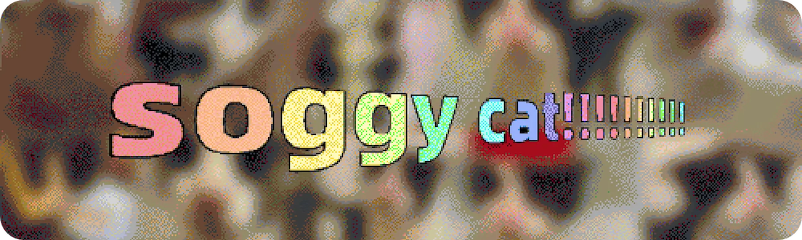
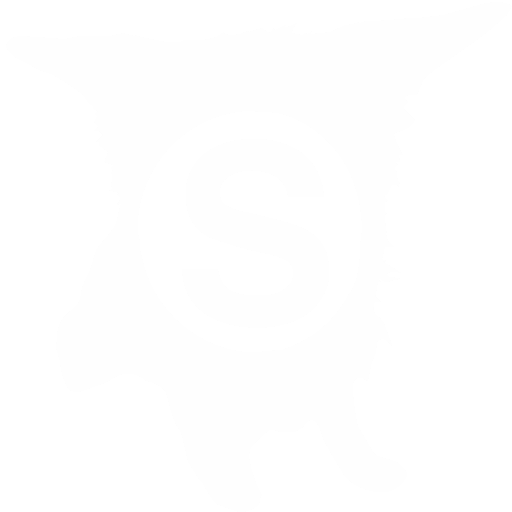

    

**wet?** nope, more like **soggy**.
**cat?** it's a **cat** for sure!  
 ``📁 thiscat ⟶ this.soggy.cat``   ``📁 team ⟶ s.soggy.cat``   ``📁 goog ⟶ goog.soggy.cat``   ``📁 bot ⟶ hourly.soggy.cat``   ``📁 ds ⟶ ds.soggy.cat (HTTP ONLY)`` 

## ⸻ credits ⸻
<table>
  <tr valign="top">
    <td>
      ⛅ <b><a href="https://github.com/RadianceCascades">mat</a></b> 
      <ul>
        <li>domain billing!</li>
        <li>dns, major components of the site</li>
      </ul>
    </td>
    <td>
      🐶 <b><a href="https://github.com/sogful">cv</a></b> 
      <ul>
        <li>bad coding</li>
        <li>brainstorming</li>
      </ul>
    </td>
    <td>
      🖥️ <b><a href="https://github.com/system2k">FP</a></b> 
      <ul>
        <li>domain billing!!</li>
        <li>regery help</li>
      </ul>
    </td>
    <td>
      🐱 <b><a href="https://github.com/lfernsy">fernsy</a></b> 
      <ul>
        <li>domain & organization setup</li>
      </ul>
    </td>
    <td>
      🌙 <b><a href="https://github.com/moon-rays">moonrays</a></b> 
      <ul>
        <li>the original frontpage css & js</li>
      </ul>
    </td>
  </tr>
</table>

<h6 align="center">
  
    ssoggycat (2022-2026)
</h6>
